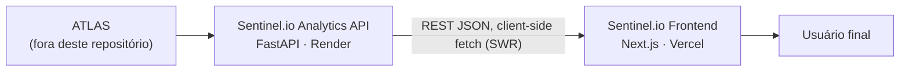

# Sentinel.io

Observatório público de dados de segurança pública do Brasil.

## Overview

Sentinel.io transforma os indicadores oficiais de segurança pública do
Brasil em um dashboard visual e interativo: KPIs nacionais, comparação
ano a ano, série temporal mensal, mapa coroplético por estado e rankings —
tudo em uma única página, sem necessidade de conta ou download de
planilha.

Este repositório contém o **frontend** do produto (`web/`), construído em
Next.js. Ele é um cliente puro de uma API REST pública e somente leitura —
a **Sentinel.io Analytics API** — mantida pela plataforma ATLAS e
publicada separadamente. Nenhum dado é processado, armazenado ou
recalculado neste repositório.

## The Problem

O Brasil publica dados de segurança pública através do Sinesp VDE (Sistema
Nacional de Informações de Segurança Pública), mantido pelo Ministério da
Justiça e Segurança Pública. São dados reais e oficiais — mas chegam ao
público em formato bruto: tabelas extensas, sem visualização, sem
comparação histórica pronta, sem mapa, sem contexto sobre o que significa
um "ano parcial". Dados que já são públicos, na prática, ficam
inacessíveis para quem não tem tempo ou ferramenta para tratá-los.

## The Solution

O Sentinel.io consome essa informação já validada via API e apresenta os
principais indicadores de forma visual: cards de KPI com variação
ano-a-ano, mapa por estado, ranking, série mensal com destaque para
períodos parciais. Zero fricção — abre no navegador e os dados já estão
lá.

## Features

- **KPIs nacionais** com variação percentual YoY e tendência colorida por
  favorável/desfavorável (respeitando a polaridade de cada indicador).
- **Comparação Year-over-Year** com recorte automático de meses
  equivalentes quando o ano corrente está incompleto.
- **Mapa coroplético** dos 27 estados, com escala sequencial por
  quantis, hover e seleção sincronizados com o ranking.
- **Ranking nacional** por UF, top 10, com barra de proporção.
- **Série temporal mensal**, com trecho de "ano parcial" destacado
  visualmente.
- **Seletor de indicador com busca**, agrupado por categoria semântica,
  sobre os 31 indicadores oficiais disponíveis.
- **Composto derivado**: soma client-side de apreensão de cocaína +
  maconha (mesma unidade), o único dado calculado no frontend.

Inventário completo — incluindo o que a API oferece mas ainda não tem
tela dedicada — em [docs/05-FEATURES.md](docs/05-FEATURES.md).

## Architecture



Toda busca de dado acontece **no navegador** via SWR — não há data
fetching server-side no Next.js. A comunicação com a API é HTTP puro,
sujeita a CORS (ver [docs/11-CORS.md](docs/11-CORS.md)). Arquitetura
completa, com diagramas de sequência e fluxo de deploy, em
[docs/02-PRODUCT_ARCHITECTURE.md](docs/02-PRODUCT_ARCHITECTURE.md).

## Data Source

Todos os dados vêm do **Sinesp VDE** (Ministério da Justiça e Segurança
Pública), servidos por uma API somente leitura mantida pela plataforma
ATLAS. Cobertura confirmada em produção (30/08/2026): **31 indicadores**,
**27 UFs**, **5.298 municípios**, período de **janeiro/2024 a junho/2026**
(último ano marcado como parcial). Limitações e como interpretar
corretamente os números em
[docs/07-DATA_INTERPRETATION.md](docs/07-DATA_INTERPRETATION.md).

## Technology Stack

| Camada | Tecnologia |
|---|---|
| Framework | Next.js 16 (App Router, Turbopack) |
| UI | React 19 |
| Linguagem | TypeScript 5 |
| Estilo | Tailwind CSS 4 |
| Data fetching/cache | SWR |
| Estado global de cliente | Zustand |
| Gráficos | Recharts |
| Mapa | d3-geo (projeção Mercator sobre GeoJSON próprio) |
| Fontes | Space Grotesk, Inter, IBM Plex Mono (`next/font`) |

Detalhes de estrutura de pastas, árvore de componentes e design system em
[docs/03-FRONTEND_ARCHITECTURE.md](docs/03-FRONTEND_ARCHITECTURE.md) e
[docs/08-DESIGN_SYSTEM.md](docs/08-DESIGN_SYSTEM.md).

## API Integration

A camada de API (`web/src/lib/api/`) cobre os 16 endpoints da Sentinel.io
Analytics API — indicadores, KPIs, temporal, geografia, rankings, radar e
metadata — através de um cliente HTTP tipado (`apiGet<T>`) e um hook SWR
por consulta (`web/src/hooks/useApi.ts`). Todos os tipos em
`web/src/types/api.ts` foram validados contra o `openapi.json` real da
API em produção. Tabela completa de endpoint, parâmetros, componente
consumidor e exemplo real de resposta em
[docs/04-API_INTEGRATION.md](docs/04-API_INTEGRATION.md).

## Development

```bash
cd web
npm install
npm run dev
```

Abre em [http://localhost:3000](http://localhost:3000). Guia completo,
incluindo como rodar contra a API de produção localmente, em
[docs/12-DEVELOPMENT.md](docs/12-DEVELOPMENT.md).

### Scripts

| Script | Descrição |
|---|---|
| `npm run dev` | Servidor de desenvolvimento (Turbopack) |
| `npm run build` | Build de produção |
| `npm run start` | Serve o build de produção |
| `npm run lint` | ESLint |

## Environment Variables

Uma única variável, lida em `web/src/lib/api/client.ts`:

```bash
# Local (padrão de fallback do código)
NEXT_PUBLIC_API_BASE_URL=http://localhost:8000/api/v1

# Produção
NEXT_PUBLIC_API_BASE_URL=https://sentinel-api-sjie.onrender.com/api/v1
```

O valor **deve incluir o sufixo `/api/v1`**. Como é uma variável
`NEXT_PUBLIC_*`, o Next.js a embute no bundle JavaScript durante o
build — defini-la depois do deploy não tem efeito; é preciso rebuildar.
Template em `web/.env.example`. Detalhes completos em
[docs/09-ENVIRONMENT.md](docs/09-ENVIRONMENT.md).

## Deployment

Hospedado na Vercel. O deploy de produção atual
(`https://sentinel-io-delta.vercel.app`) já está conectado à API real do
Render — confirmado inspecionando o bundle publicado. A API permite CORS
para `localhost:3000`, `sentinel-io.vercel.app` e
`sentinel-io-delta.vercel.app` — qualquer outro domínio (incluindo
preview deployments da Vercel) precisa ser adicionado à allowlist do lado
da API antes de funcionar. Detalhes em
[docs/10-DEPLOYMENT.md](docs/10-DEPLOYMENT.md) e
[docs/11-CORS.md](docs/11-CORS.md).

## Documentation

Documentação completa e detalhada em [`docs/`](docs/README.md):

| | |
|---|---|
| [01 — Visão do Produto](docs/01-PRODUCT_OVERVIEW.md) | [02 — Arquitetura](docs/02-PRODUCT_ARCHITECTURE.md) |
| [03 — Arquitetura do Frontend](docs/03-FRONTEND_ARCHITECTURE.md) | [04 — Integração com a API](docs/04-API_INTEGRATION.md) |
| [05 — Funcionalidades](docs/05-FEATURES.md) | [06 — Guia do Usuário](docs/06-USER_GUIDE.md) |
| [07 — Interpretação dos Dados](docs/07-DATA_INTERPRETATION.md) | [08 — Design System](docs/08-DESIGN_SYSTEM.md) |
| [09 — Variáveis de Ambiente](docs/09-ENVIRONMENT.md) | [10 — Deploy](docs/10-DEPLOYMENT.md) |
| [11 — CORS](docs/11-CORS.md) | [12 — Desenvolvimento Local](docs/12-DEVELOPMENT.md) |
| [13 — Troubleshooting](docs/13-TROUBLESHOOTING.md) | |

## Roadmap

Sugestões, não compromissos — nada aqui está implementado além do que já
está marcado `[ATUAL]`.

- `[ATUAL]` KPIs, YoY, série temporal, mapa por UF, ranking de UF,
  seletor de indicador.
- `[PLANEJADO]` Conectar o filtro global de UF/abrangência já declarado
  em `store/filters.ts` (`uf`, `abrangencia`) a uma UI real — hoje a
  seleção de UF é estado local, não integrada ao store.
- `[PLANEJADO]` Telas para os endpoints já suportados pela camada de API
  mas sem interface: ranking de municípios, ranking por indicador,
  detalhe de indicador, totais por município.
- `[PLANEJADO]` Estados de erro visíveis (hoje uma falha de API resulta
  em carregamento infinito, sem mensagem — ver
  [docs/05-FEATURES.md](docs/05-FEATURES.md#estados-de-erro)).
- `[FUTURO]` Painel/visualização para o endpoint de Radar (detecção de
  anomalias por z-score), já integrado na camada de dados mas sem tela.
- `[FUTURO]` Exportação de dados, cache mais agressivo, observabilidade
  de erros no cliente (ex.: Sentry), tema claro.

## Engineering Highlights

- **Integração frontend/backend desacoplada**: o Sentinel.io não conhece
  nada sobre como os dados são calculados — consome uma API REST versionada
  e documentada via OpenAPI, com tipos TypeScript mantidos em paridade
  manual e validados contra o schema real.
- **16 endpoints, 1 cliente HTTP tipado**: `apiGet<T>()` centraliza
  montagem de URL, serialização de query params e tratamento de erro
  (`ApiError` tipado a partir do formato de erro documentado pela API).
- **Data fetching client-side com SWR**: cache, deduplicação (60s) e
  fetching condicional (`useSWR(query ? [...] : null, ...)`) para evitar
  requests com parâmetros incompletos — sem estado de loading manual
  espalhado pelo código.
- **Estado global mínimo**: um único store Zustand compartilha a seleção
  de filtro entre componentes distantes na árvore, sem prop drilling.
- **Visualização de dados sem dependência pesada**: mapa coroplético em
  SVG puro com `d3-geo`, sparklines em SVG feitos à mão — só o gráfico de
  área principal usa uma biblioteca de charting (Recharts).
- **Deploy cloud completo**: Vercel (frontend) + Render (API), com
  configuração de CORS explícita entre os dois e variáveis
  `NEXT_PUBLIC_*` corretamente tratadas como valores de build-time, não
  runtime.
- **Auditoria própria documentada**: toda a documentação em [`docs/`](docs/README.md)
  foi validada contra código-fonte e chamadas reais à API de produção —
  inclusive suas lacunas (endpoints sem UI, ausência de tratamento de
  erro, estado não conectado), listadas sem maquiagem.
