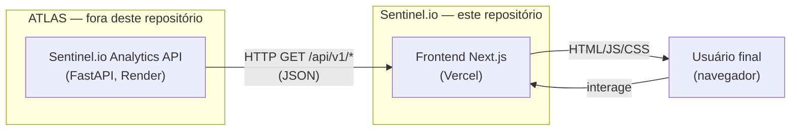

# 01 — Visão do Produto

[← Índice](README.md)

## O que é o Sentinel.io

O Sentinel.io é um **observatório público de dados de segurança pública no
Brasil**. É um site que qualquer pessoa pode abrir no navegador para ver,
de forma visual e interativa, o que os dados oficiais do governo dizem
sobre criminalidade, ações policiais, apreensões e outros indicadores de
segurança — sem precisar saber ler planilhas, SQL ou estatística.

A página inicial mostra, hoje:

- Os principais números do país no período mais recente disponível.
- Como esses números mudaram em relação ao ano anterior.
- Onde, geograficamente (por estado), os registros se concentram mais.
- Como cada indicador evoluiu mês a mês ao longo do tempo.

## O problema que resolve

O Brasil publica dados de segurança pública através do **Sinesp VDE**
(Sistema Nacional de Informações de Segurança Pública — Visão de Dados
Estatísticos), mantido pelo Ministério da Justiça e Segurança Pública. Esses
dados são reais e oficiais, mas chegam ao público em um formato bruto —
tabelas extensas, sem contexto visual, sem comparação histórica pronta, sem
mapa, sem explicação do que é "ano parcial" ou o que significa cada
indicador.

Na prática, isso significa que dados que já são públicos acabam
inacessíveis para a maior parte das pessoas — jornalistas sem tempo para
tratar planilhas, pesquisadores que precisam cruzar múltiplas fontes,
cidadãos que só querem entender o que está acontecendo no seu estado.

O Sentinel.io existe para fechar essa distância entre **"o dado existe"** e
**"o dado é compreensível"**.

## Por que dados públicos importam

Dados de segurança pública tratados com rigor e apresentados sem viés
editorial são uma ferramenta de controle social: permitem que qualquer
pessoa — não só especialistas — acompanhe tendências, cobre políticas
públicas e forme opinião a partir de evidência, não de achismo. O rodapé do
próprio produto resume esse compromisso: dados "tratados e publicados sem
viés editorial — a leitura é de cada visitante."

## Como o usuário final utiliza a plataforma

Um visitante abre `sentinel-io-delta.vercel.app`, e sem precisar criar
conta, configurar nada ou baixar arquivo algum:

1. Vê de cara os indicadores nacionais mais relevantes do período mais
   recente.
2. Pode trocar o indicador em foco (ex.: de "Homicídio doloso" para "Roubo
   de veículo") e o mapa, o ranking e o gráfico temporal da página
   respondem a essa escolha.
3. Passa o mouse por um estado no mapa ou por uma linha do ranking e vê o
   valor exato.
4. Rola a página e vê a evolução mensal do indicador escolhido, com aviso
   explícito quando o ano corrente ainda está incompleto ("dados
   parciais").

Tudo acontece na mesma página — não há telas separadas de login, busca ou
configuração.

## Quem pode utilizar

Não há controle de acesso: a plataforma é pública e gratuita. Os perfis de
uso mais diretos:

- **Jornalistas** que precisam de um número ou tendência confiável
  rapidamente, sem tratar a planilha bruta do Sinesp.
- **Pesquisadores e analistas de políticas públicas** que querem uma visão
  panorâmica antes de aprofundar em uma fonte primária.
- **Cidadãos e estudantes** que querem entender, de forma simples, o que
  está acontecendo na segurança pública do seu estado ou do país.

## Qual é a diferença entre ATLAS e Sentinel.io

São dois produtos com responsabilidades diferentes:

| | ATLAS | Sentinel.io |
|---|---|---|
| **O que é** | A plataforma de dados/analytics por trás dos números — expõe uma API REST somente leitura (`Sentinel.io Analytics API`, OpenAPI v1.0.0) | O site público que qualquer pessoa visita para visualizar esses dados |
| **Responsabilidade** | Consolidar, validar e servir os indicadores já calculados | Buscar esses indicadores via HTTP e apresentá-los como mapa, gráfico, KPI e ranking |
| **Onde roda** | Serviço próprio, hospedado no Render (`sentinel-api-sjie.onrender.com`) | Aplicação Next.js hospedada na Vercel |
| **Quem acessa diretamente** | O Sentinel.io (e qualquer outro cliente HTTP) | O usuário final, no navegador |

> O que se sabe sobre o ATLAS nesta documentação vem exclusivamente do que
> a API expõe publicamente. A própria API se descreve, na sua
> especificação OpenAPI, como uma camada "somente leitura" que "consulta o
> Data Warehouse já validado nas Fases 1-2 (PostgreSQL + camada analítica
> SQL)", sem recalcular regras de agregação, unidade ou ano parcial em
> Python — tudo herdado do banco. O código-fonte do ATLAS não faz parte
> deste repositório e não foi auditado aqui.

## Como os dois produtos se conectam

A conexão é puramente HTTP: o Sentinel.io é um cliente da API do ATLAS.
Não existe banco de dados, arquivo ou processo compartilhado entre os
dois — o frontend não sabe (nem precisa saber) como os dados foram
calculados, apenas consome os endpoints REST documentados em
[04 — Integração com a API](04-API_INTEGRATION.md).

Ver a arquitetura completa, com todos os pontos de comunicação, em
[02 — Arquitetura do Produto](02-PRODUCT_ARCHITECTURE.md).
