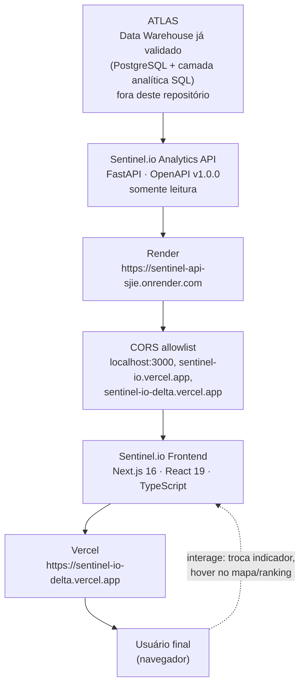
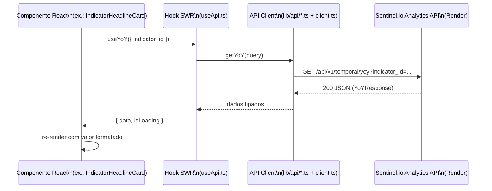
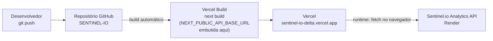

# 02 — Arquitetura do Produto

[← Índice](README.md)

## Visão geral

O Sentinel.io é um cliente HTTP puro: não tem backend próprio, banco de
dados ou processo server-side de dados. Toda a lógica de negócio
(agregação, ranking, série temporal, ano parcial) já vem pronta da API do
ATLAS — o frontend apenas busca, formata e desenha.

Este diagrama reflete o que foi **observado e confirmado** durante a
auditoria (30/08/2026): a API responde em produção no Render, o CORS foi
testado origem a origem, e o bundle JavaScript publicado em
`sentinel-io-delta.vercel.app` contém a URL do Render já embutida — ou
seja, o deploy de produção atual já está conectado à API real.

## Separação frontend / backend

A separação é estrita: o repositório do Sentinel.io (`web/`) não contém
nenhum código de ETL, banco de dados, cálculo de indicador ou lógica de
agregação. Toda essa responsabilidade pertence à API. O contrato entre os
dois lados é exclusivamente:

- **Protocolo**: HTTP/HTTPS, método `GET`, respostas JSON.
- **Formato de erro**: `{ "error": { "code": "...", "message": "..." } }`
  (tratado em `web/src/lib/api/client.ts`).
- **Base URL**: única variável de ambiente,
  [`NEXT_PUBLIC_API_BASE_URL`](09-ENVIRONMENT.md).

## Onde a busca de dados acontece: no navegador, não no servidor

Ponto importante e verificado no código: **todo componente que busca dados
é um Client Component** (`"use client"` no topo do arquivo — confirmado em
todos os componentes de `home/`, `maps/`, `rankings/` e `filters/`). Isso
significa que as chamadas à API acontecem **no navegador do usuário**, via
[SWR](https://swr.vercel.app/), depois que a página já chegou como HTML.
Não há data fetching no servidor Next.js (nenhum `fetch` em Server
Component ou Route Handler foi encontrado em `web/src/app/`).

Isso tem duas consequências práticas, ambas documentadas em detalhe em
[04 — Integração com a API](04-API_INTEGRATION.md) e
[11 — CORS](11-CORS.md):

1. **CORS importa de verdade** — como o `fetch` roda no navegador, a
   origem que precisa estar liberada na API é o domínio que o usuário está
   visitando (`sentinel-io-delta.vercel.app` em produção), não um servidor
   Next.js.
2. **`NEXT_PUBLIC_API_BASE_URL` precisa estar correta em build-time** —
   como o valor é lido em código que roda no navegador, o Next.js precisa
   embuti-lo no bundle JavaScript durante o `next build`. Detalhado em
   [09 — Variáveis de Ambiente](09-ENVIRONMENT.md).

## Fluxo de comunicação: componente → API → tela

Se a API responder um status não-2xx, `apiGet` lança um `ApiError`
tipado (mensagem + status + código, quando a API os fornece) — mas,
conforme documentado em [05 — Funcionalidades](05-FEATURES.md), **nenhum
componente hoje trata esse erro visualmente**: o SWR apenas não popula
`data`, e o componente permanece no seu estado de carregamento/vazio.

## Estado compartilhado no cliente

Um único store [Zustand](https://github.com/pmndrs/zustand)
(`web/src/store/filters.ts`) guarda a seleção atual do usuário
(`indicatorId`, `year`, `uf`, `abrangencia`) e é lido por múltiplos
componentes ao mesmo tempo — é o que permite que trocar o indicador em um
card do topo da página atualize o mapa, o ranking e o gráfico mais abaixo,
sem prop drilling. Detalhes de quais campos estão realmente conectados a
alguma UI em [03 — Arquitetura do Frontend](03-FRONTEND_ARCHITECTURE.md).

## Deploy — visão de infraestrutura

Detalhado em [10 — Deploy](10-DEPLOYMENT.md).

## O que este documento não cobre

Pipeline de ETL, PostgreSQL, DuckDB, modelagem dimensional e qualquer
detalhe interno de como o ATLAS produz os indicadores estão fora do
escopo — porque estão fora deste repositório e não foram auditados aqui.
Onde a arquitetura popular do produto ("PostgreSQL → DuckDB → FastAPI")
é mencionada em qualquer lugar desta documentação, é citada apenas como
contexto de origem externa, nunca como fato verificado em código.
