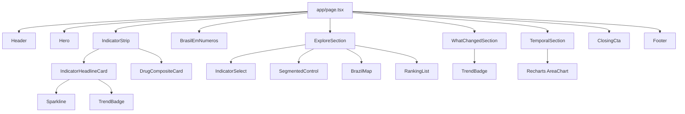

# 03 — Arquitetura do Frontend

[← Índice](README.md)

## Stack confirmada (`web/package.json`)

| Camada | Tecnologia | Versão |
|---|---|---|
| Framework | Next.js (App Router) | 16.3.2 |
| UI | React / React DOM | 19.2.8 |
| Linguagem | TypeScript | ^5 |
| Estilo | Tailwind CSS | ^4 (`@tailwindcss/postcss`) |
| Data fetching/cache | SWR | ^2.5.1 |
| Estado global de cliente | Zustand | ^5.0.15 |
| Gráficos | Recharts | ^3.10.1 |
| Projeção geográfica | d3-geo | ^3.1.1 |
| Utilitário de classes | clsx | ^2.1.1 |
| Lint | ESLint 9 + `eslint-config-next` | ^9 / 16.3.2 |

Não há framework de testes, biblioteca de animação, CMS, ou gerenciador de
formulários no `package.json` — nenhum desses existe no projeto hoje.

## Estrutura de diretórios (`web/src`)

```
src/
├── app/
│   ├── layout.tsx        # <html>/<body>, fontes (next/font), metadata
│   ├── page.tsx           # Home — única rota da aplicação
│   └── globals.css         # Tailwind + design tokens (ver 08-DESIGN_SYSTEM.md)
├── components/
│   ├── home/                # As 7 seções que compõem a home
│   ├── layout/                # Header, Footer
│   ├── maps/                   # BrazilMap (SVG + d3-geo)
│   ├── rankings/                 # RankingList
│   ├── filters/                    # IndicatorSelect
│   └── ui/                           # Container, SectionHeading, SegmentedControl,
│                                      # Sparkline, TrendBadge — blocos genéricos
├── hooks/
│   └── useApi.ts             # Um hook SWR por consulta possível à API
├── lib/
│   ├── api/                    # Um módulo por recurso da API + client.ts (fetch tipado)
│   ├── constants/indicators.ts   # Polaridade, indicadores de destaque, composto de drogas
│   ├── geo/                        # GeoJSON dos estados + projeção d3-geo
│   └── utils/                        # format.ts (números/datas pt-BR), colorScale.ts
├── store/
│   └── filters.ts             # Zustand — estado de filtro compartilhado
└── types/
    └── api.ts                  # Tipos espelhando o schema OpenAPI da API
```

Há **apenas uma rota** na aplicação: `/` (`app/page.tsx`). Não existem
outras páginas, rotas dinâmicas, API Routes ou Route Handlers no projeto.

## Árvore de componentes da home



`layout.tsx` e `page.tsx` são Server Components (nenhuma diretiva
`"use client"`); todo o restante da árvore acima que busca dados ou tem
interação (`onClick`, `onMouseEnter`, estado local) é Client Component —
confirmado pela diretiva `"use client"` presente em: `Hero`,
`IndicatorStrip`, `IndicatorHeadlineCard`, `DrugCompositeCard`,
`BrasilEmNumeros`, `ExploreSection`, `WhatChangedSection`,
`TemporalSection`, `BrazilMap`, `RankingList`, `IndicatorSelect`,
`SegmentedControl`, `Sparkline`. `ClosingCta`, `Header`, `Footer`,
`Container`, `SectionHeading` e `TrendBadge` são Server Components (não
têm estado nem dados próprios).

## As 7 seções da home (em ordem de renderização)

| # | Componente | Eyebrow/título na UI | Dados que consome |
|---|---|---|---|
| — | `Hero` | "Sentinel.io — Observatório de Dados" | `useMetadata()` |
| 1 | `IndicatorStrip` | "Panorama Nacional" / "Principais indicadores" | `useIndicators()`, e por card: `useYoY`, `useTemporal` |
| 2 | `BrasilEmNumeros` | "Brasil {ano}" / "O Brasil em números" | `useMetadata()`, `useKpis({ ano })` |
| 3 | `ExploreSection` | "Distribuição Geográfica" / "Onde os registros se concentram" | `useIndicators()`, `useYears()`, `useUFTotals`, `useUFRanking` |
| 4 | `WhatChangedSection` | "Comparação Anual" / "O que mudou?" | `useIndicators()`, `useYears()`, `useMetadata()`, `useTemporal` |
| 5 | `TemporalSection` | "Série Mensal" / "Evolução temporal" | `useIndicators()`, `useYears()`, `useTemporal` |
| — | `ClosingCta` | Texto fixo (ver observação abaixo) | Nenhum — texto estático |

> **Observação de auditoria**: o texto do `ClosingCta`
> ("31 indicadores. 27 UFs. 5.298 municípios.") é uma **string fixa no
> JSX**, não vem de `useMetadata()`. Hoje ela bate exatamente com os
> números reais da API (confirmado em 30/08/2026: `coverage.indicators=31`,
> `coverage.ufs=27`, `coverage.municipalities=5298`), mas não se atualiza
> automaticamente se a cobertura mudar — é uma manutenção manual. Ver
> [13 — Troubleshooting](13-TROUBLESHOOTING.md).

## Estado global (`store/filters.ts`)

```ts
interface FiltersState {
  indicatorId: number;   // usado — controla o indicador em foco em toda a home
  year: number | null;   // usado — controla o ano no mapa/ranking (ExploreSection)
  uf: string | null;         // declarado, sem nenhum leitor/escritor na UI
  abrangencia: string | null; // declarado, sem nenhum leitor/escritor na UI
}
```

**Achado de auditoria**: `uf` e `abrangencia`, com seus setters `setUF` e
`setAbrangencia`, existem no store mas **nenhum componente os lê ou os
chama** — busquei por `setUF(`, `setAbrangencia(`, `.uf` e
`.abrangencia` fora do próprio `filters.ts` e não há nenhuma referência.
A seleção de UF que existe hoje (hover/clique no mapa e no ranking) é
**estado local do React** dentro de `ExploreSection`
(`useState<string | null>` para `hoveredUF`/`selectedUF`), passado como
prop para `BrazilMap` e `RankingList` — não passa pelo store global. Na
prática, isso parece ser scaffolding para um filtro global de UF/
abrangência ainda não construído na interface. Ver
[05 — Funcionalidades](05-FEATURES.md) e a seção de roadmap no
[README](../README.md).

## Camada de API (`lib/api/`)

Um módulo por recurso, todos construídos sobre o mesmo cliente HTTP —
documentado em profundidade em
[04 — Integração com a API](04-API_INTEGRATION.md):

```
lib/api/
├── client.ts       # apiGet<T>() + ApiError — único ponto que monta a URL final
├── indicators.ts
├── kpis.ts
├── temporal.ts
├── geography.ts
├── rankings.ts
├── radar.ts          # exposto pelo client e pelo hook useRadar — sem consumidor na UI hoje
├── metadata.ts
└── index.ts          # reexporta tudo
```

## Hooks (`hooks/useApi.ts`)

Cada chamada de API tem um hook SWR correspondente, todos com a mesma
política de revalidação:

```ts
const REVALIDATE = { revalidateOnFocus: false, dedupingInterval: 60_000 };
```

Ou seja: não refaz a busca automaticamente quando a aba volta ao foco, e
deduplica chamadas idênticas por 60 segundos. Hooks cuja query pode não
estar pronta ainda (ex.: dependem de um `year` que só chega depois de
outra chamada) aceitam `null` como query e o SWR simplesmente não dispara
a busca (`useSWR(query ? [...] : null, ...)`) — é assim que
`useTemporal`, `useYoY`, `useUFTotals`, `useUFRanking`,
`useMunicipalityRanking` e `useIndicatorRanking` evitam requests com
parâmetros incompletos.

## Tipos (`types/api.ts`)

Todos os tipos são anotados no próprio arquivo como espelhando "o schema
OpenAPI da Sentinel.io Analytics API (v1.0.0)", com a fonte de verdade
declarada como `GET /openapi.json` na própria API. A auditoria confirmou
que essa afirmação é real: todos os campos de request/response
verificados batem exatamente com o `openapi.json` publicado em produção
(ver [04 — Integração com a API](04-API_INTEGRATION.md)).

## Constantes de domínio (`lib/constants/indicators.ts`)

- `DEFAULT_INDICATOR_ID = 12` — "Homicídio doloso", o indicador selecionado
  por padrão em toda a home.
- `HEADLINE_INDICATOR_IDS = [12, 10, 17, 25]` — os 4 cards do
  `IndicatorStrip` ("Homicídio doloso", "Feminicídio", "Morte por
  intervenção de Agente do Estado", "Roubo de veículo" — confirmado contra
  a API real).
- `DRUG_SEIZURE_COMPOSITE` — soma client-side de "Apreensão de Cocaína"
  (id 1) + "Apreensão de Maconha" (id 2), ambos em kg, mesma
  `familia_medida` ("peso") — a API nunca retorna esse total combinado.
- `getPolarity()` — define se um indicador subindo é bom, ruim ou neutro,
  por `grupo_semantico`, com uma exceção pontual: o indicador 21 ("Pessoa
  Localizada") é `up-is-favorable` mesmo pertencendo ao grupo "Vítimas"
  (cujo padrão é `down-is-favorable`).

Todos os IDs acima foram confirmados contra os 31 indicadores reais
retornados por `GET /api/v1/indicators` em produção.
