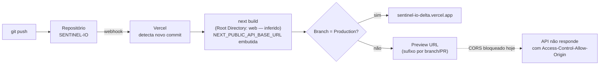

# 10 — Deploy

[← Índice](README.md)

## Estado real confirmado

| Item | Valor | Como foi confirmado |
|---|---|---|
| Plataforma | Vercel | URL do domínio (`*.vercel.app`) |
| URL de produção | `https://sentinel-io-delta.vercel.app` | Testada diretamente — responde `HTTP 200` |
| Framework detectado | Next.js 16 (Turbopack) | Nomes de chunk `_next/static/immutable/chunks/*` característicos do build do Next.js |
| API consumida pelo build atual | `https://sentinel-api-sjie.onrender.com/api/v1` | A string `onrender.com/api/v1` foi encontrada, literalmente embutida, em um dos chunks JS publicados |
| Origens liberadas por CORS para este domínio | Confirmado — ver [11 — CORS](11-CORS.md) | Testado com header `Origin` real |

**Conclusão de auditoria**: o deploy de produção atual **já está
conectado à API real do Render** — não está usando um valor de
`localhost` nem um valor desatualizado. Isso foi verificado inspecionando
o bundle JavaScript publicamente servido, não apenas assumido.

## O que não pôde ser confirmado

Sem acesso ao painel do projeto na Vercel, os seguintes itens **não podem
ser verificados diretamente** — são inferências razoáveis a partir da
estrutura do repositório, não fatos confirmados:

- **Root Directory do projeto na Vercel**: o repositório tem a aplicação
  Next.js dentro de `web/` (não na raiz), e não existe `vercel.json` na
  raiz redirecionando o build. Para o deploy funcionar como observado, o
  Root Directory do projeto Vercel quase certamente está configurado como
  `web`. **Não confirmado** por acesso direto ao painel.
- Exatamente quais variáveis estão escopadas para Production vs. Preview
  vs. Development no painel da Vercel.
- Qual branch está configurada como Production Branch.
- Configurações de build customizadas (Build Command / Install Command),
  se houver alguma além do padrão do Next.js.

## Build

Não há configuração customizada de build no repositório — `next.config.ts`
está vazio (`{ /* config options here */ }`), sem `rewrites`, `redirects`
ou `env` explícitos. O comando de build é o padrão do `package.json`:

```bash
npm run build   # → next build
```

O Next.js detecta automaticamente que é um projeto App Router e usa
Turbopack (confirmado pelos logs do próprio `next dev`/`next build`
localmente: `▲ Next.js 16.3.2 (Turbopack)`).

## Variáveis de ambiente necessárias no deploy

Uma única variável, detalhada em
[09 — Variáveis de Ambiente](09-ENVIRONMENT.md):

```
NEXT_PUBLIC_API_BASE_URL=https://sentinel-api-sjie.onrender.com/api/v1
```

Ela precisa estar presente **antes** do build rodar — não depois. Ver a
explicação de por quê em
[09 — Variáveis de Ambiente](09-ENVIRONMENT.md#por-que-build-time-importa-no-nextjs).

## Preview deployments

A Vercel gera automaticamente uma URL própria para cada branch/PR (Preview
Deployment). Essas URLs têm domínios com sufixo variável — algo como
`sentinel-io-<hash-ou-branch>.vercel.app` — diferentes do domínio de
produção `sentinel-io-delta.vercel.app`.

**Ponto crítico confirmado**: a allowlist de CORS na API é uma lista fixa
de origens exatas (ver [11 — CORS](11-CORS.md)). Um domínio de preview
gerado automaticamente pela Vercel **não está nessa lista** — foi testado
diretamente e o request é bloqueado (a API responde sem o header
`Access-Control-Allow-Origin`). Ou seja: **testar um PR em um preview
deployment da Vercel hoje resulta em uma home page sem nenhum dado
carregado**, por CORS — não é um bug do frontend.

## Fluxo de deploy



## Checklist para um novo deploy correto

1. Confirmar que `NEXT_PUBLIC_API_BASE_URL` está definida no painel da
   Vercel para o ambiente de destino (Production e/ou Preview), com o
   valor correto e incluindo `/api/v1`.
2. Disparar o build/deploy (push na branch de produção, ou redeploy manual
   se a variável mudou e nenhum código mudou).
3. Depois do deploy, verificar se o domínio final está na allowlist de
   CORS da API (ver [11 — CORS](11-CORS.md)) — senão, os dados não vão
   carregar mesmo com o build correto.
